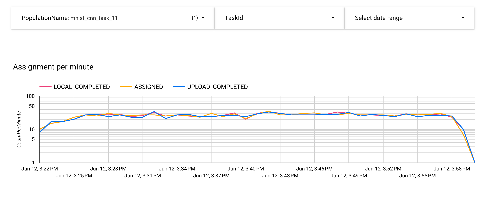

# Looker SQL Dashboard

This directory contains the SQLs that build data source for looker studio. It can be used to power the Looker dashboards for odp-federatedcompute projects.

## How to Use

## Prerequisite: Get familiar with Looker Studio.

[Looker Studio](https://cloud.google.com/looker-studio?hl=en) is a web-based data visualization tool by Google. It allows you to create interactive dashboards and reports by connecting to a wide range of data sources. We provide the looker studio based metrics for federatedcompute project. \
Please follow [Quick start guide](https://support.google.com/looker-studio/answer/9171315) to get familiar with this tool.

## Instruction

To build a looker dashboard, it involves 2 steps in general:
1. Prepare the data source:
   - After deploying the application, at GCP spanner instances, there should be a few databases, e.g. “fcp-metric-<env>” or “fcp-task-<env>”.
   - Follow [here](https://support.google.com/looker-studio/answer/9008245?hl=en#zippy=%2Cin-this-article) to set up a looker data source with connection to tables, using the query provided by [sql](sql) folder.
   - Keep/Modify the fields
2. Create visualizations
   - Create a [report](https://support.google.com/looker-studio/answer/6292570?hl=en#create&zippy=%2Cin-this-article) and adjust the UI settings.

Below are the detailed instructions for creating several common chart types in Looker using your Spanner database.

### Model Metrics

It shows the model metrics trend over the training rounds.

1. Prepare data source
   - Set up a looker data source(“ModelMetrics”) with connection to database `fcp-metric-<env>`, using the query of [model_metrics.sql](sql/model/model_metrics.sql).
   - Keep the auto generated fields: `MetricsName`, `MetricsValue`, `IterationId`, `PopulationName`(optional), `TaskId`(optional), and etc.
   - Add a new calculated field `PopulationName/TaskId - MetricName` with formula “CONCAT(CONCAT(PopulationName,`/`, TaskId),`-`, MetricName)”.
2. Create visualizations
   -  Create a [report](https://support.google.com/looker-studio/answer/6292570?hl=en#create&zippy=%2Cin-this-article).
   -  Add a [dropped down list control](https://support.google.com/looker-studio/answer/11335992?sjid=5245982725886925884-NC#zippy=%2Clist-control-data-options%2Clist-control-style-options)\
   Data source: set to `ModelMetrics` created at step 1.\
   Control Field: set to field “PopulationName/TaskId - MetricName” field with default value `null`.\
   Style Control: set to `Drop-down`, enable the search checkbox.
   -  Add a [line chart](https://support.google.com/looker-studio/answer/7398001?hl=en):\
   Data source: set to `ModelMetrics` created at step 1.\
   Dimension: add a “Training Round” with field of `IterationId`.\
   Breakdown dimension: set to `PopulationName/TaskId - MetricName` field.\
   Metric: set to `MetricsValue` field with `MIN` aggregation.\
   Sort: set to `IterationId` field with `MIN` aggregation, ascending order.\
   Style Title: set to `Model Metrics`.
3. Chart should look like below

### Task detail
It is a set of charts that shows the running status of a task.

#### Common filters
It is used to filter data of the chart in this page.
1. Prepare data source
   - Set up a data source `Iteration` with connection to database `fcp-task-<env>`, using the query of [iteration.sql](sql/ops/iteration.sql).
   - Keep the auto generated fields: `TaskId`(Number), `IterationId`(Number), `ReportGoal`(Number), `AttemptId`(Number), `PopulationName`(Text), `Status`(Text), `LastUpdatedTime`(Text),
   - Set data refresh ness to 15 minutes.
2. Add filters
   -  Add a "Population Name" [dropped down list control](https://support.google.com/looker-studio/answer/11335992?sjid=5245982725886925884-NC#zippy=%2Clist-control-data-options%2Clist-control-style-options).
   Data source: set to `Iteration` created at step 1.
   Control Field: set to field `PopulationName` field with default value `null`.
   Style Control: set to `Drop-down`, single-select, enable the search checkbox.
   -  Add a "Task ID" [dropped down list control](https://support.google.com/looker-studio/answer/11335992?sjid=5245982725886925884-NC#zippy=%2Clist-control-data-options%2Clist-control-style-options).
   Data source: set to `Iteration` created at step 1.
   Control Field: set to field “TaskId” field with default value to empty.
   Style Control: set to `Drop-down`, single-select, allow to select all, enable the search checkbox.
   - Add a [date range control](https://support.google.com/looker-studio/answer/6291067?hl=en#zippy=%2Cin-this-article)
   Set "Default date range" to "Auto date range".

#### Assignment per minute
It shows the assignments status per minute.

1. Prepare data source
   - Set up a data source `Assignment Per Minute` with connection to database `fcp-task-<env>`, using the query of [assignment_per_minute.sql](sql/ops/assignment_per_minute.sql).
   - Keep the auto generated fields: `CountPerMinute`(Number), `CreatedTimeMinute`(Date Hour Minute), `IterationId`(Text), `PopulationName`(Text), `TaskId`(Number).
   - Set data refresh ness to 15 minutes.
2. Create visualizations
   -  Add a [time series chart](https://support.google.com/looker-studio/answer/7398001?hl=en):\
      Data source: set to `Assignment Per Minute` created at step 1.\
      Date Range Dimension: set to `CreatedTimeMinute`.\
      Dimension: set to `CreatedTimeMinute`.\
      Breakdown dimension: set to `Status` field.\
      Metric: set to `CountPerminute` field with `SUM` aggregation.\
      Breakdown dimension sort: set to `CountPerminute` field with `SUM` aggregation, descending order.\
      Default date range: select `Auto`.
      Chart interactions: select `Zoom`.
      Style Title: set to `Assignment Per Minute`, check the `Show title` checkbox.
3. Chart should look like below
