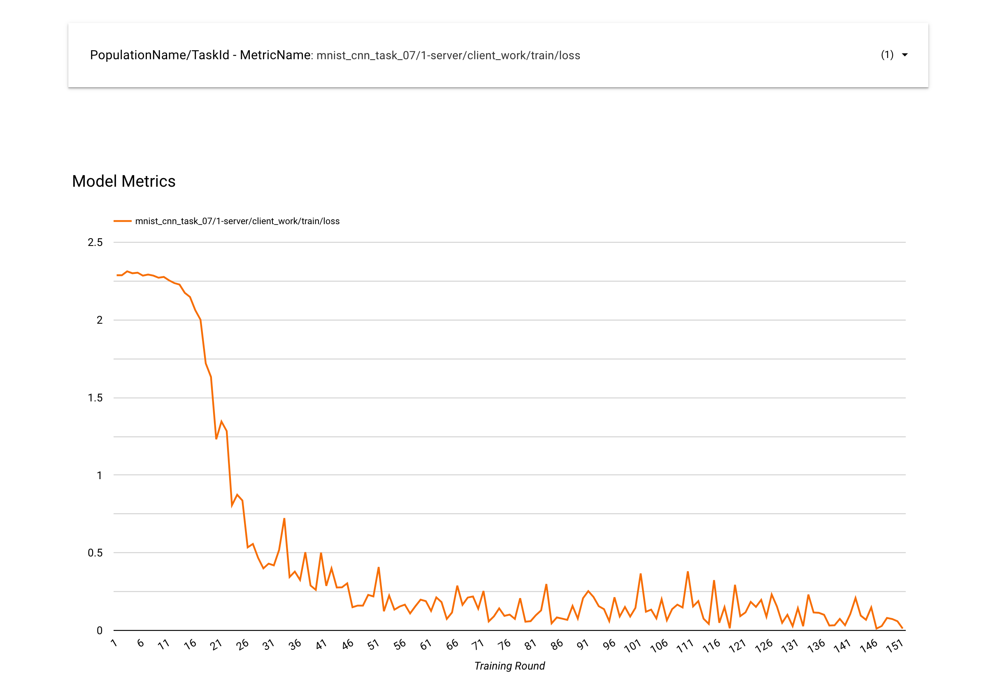

# Looker SQL Dashboard

This directory contains the SQLs that build data source for looker studio. It can be used to power the Looker dashboards for odp-federatedcompute projects.

## How to Use

## Prerequisite: Get familiar with Looker Studio.

[Looker Studio](https://cloud.google.com/looker-studio?hl=en) is a web-based data visualization tool by Google. It allows you to create interactive dashboards and reports by connecting to a wide range of data sources. We provide the looker studio based metrics for federatedcompute project. \
Please follow [Quick start guide](https://support.google.com/looker-studio/answer/9171315) to get familiar with this tool.

## Instruction

This is an instruction about setting up Model Metric chart.

1. Prepare the data source
   - After deploying the application, at GCP spanner instances, there should be a database called “fcp-metric-<env>”, and there is a table with name “ModelMetrics”.
   - Follow [here](https://support.google.com/looker-studio/answer/9008245?hl=en#zippy=%2Cin-this-article) to set up a looker data source(“ModelMetrics”) with connection to tables, using the query of [model_metrics.sql](sql/model/model_metrics.sql).
   - Keep the auto generated fields, like "MetricsName", "MetricsValue", "IterationId", "PopulationName"(optional), "TaskId"(optional), and etc.
   - Add a new calculated field "PopulationName/TaskId - MetricName" with formula “CONCAT(CONCAT(PopulationName,"/", TaskId),"-", MetricName)”.
2. Create visualizations
   -  Create a [report](https://support.google.com/looker-studio/answer/6292570?hl=en#create&zippy=%2Cin-this-article).
   -  Add a [dropped down list control](https://support.google.com/looker-studio/answer/11335992?sjid=5245982725886925884-NC#zippy=%2Clist-control-data-options%2Clist-control-style-options)\
   Data source: set to "ModelMetrics" created at step 1.\
   Control Field: set to field “PopulationName/TaskId - MetricName” field with default value "null".\
   Style Control: set to "Drop-down", enable the search checkbox.
   -  Add a [line chart](https://support.google.com/looker-studio/answer/7398001?hl=en):\
   Data source: set to "ModelMetrics" created at step 1.\
   Dimension: add a “Training Round” with field of "IterationId".\
   Breakdown dimension: set to "PopulationName/TaskId - MetricName" field.\
   Metric: set to "MetricsValue" field with "MIN" aggregation.\
   Sort: set to "IterationId" field with "MIN" aggregation, ascending order.\
   Style Title: set to "Model Metrics".
3. Once completed, the chart should look like below

